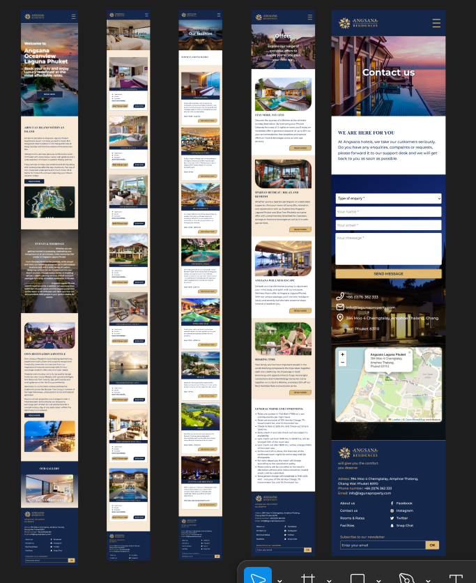

# React application with support for desktop and mobile devices. 

## demonstration

🌐 project deployed on server : http://37.1.215.81:3002 
   deploy infrastructure:
   - VPS (Ubuntu 20.04)  
   - Nginx  
   - Docker

<p align="center">
  
  
  
  
  
  
</p>

## Technologies

Initial implementation: HTML, SCSS, Native JS (then the project was transferred to react)

Modern version: 

-  React (Functional Components + Hooks)
-  Vite 5.2.0
-  Redux Toolkit
-  React Router v6 
-  Axios
-  Formik + Yup (forms)
-  Framer-motion (pages animation)
-  Swiper.js (sliders)
-  Leaflet (interactive maps)
-  Json-server (backend imitation)

## Setup

```bash
$ git clone https://github.com/AnastasiaDubinina022/angsana-hotel.git
$ cd angsana-hotel
$ npm i
$ npm run dev
```

## Build

```bash
$ npm build
```